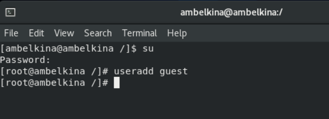

---
# Front matter
lang: ru-RU
title: "Лабораторнаяработа No 3"
subtitle: "Дискреционное разграничение прав в Linux. Два пользователя"
author: "Белкина Анастасия Михайловна"

# Formatting
toc-title: "Содержание"
toc: true # Table of contents
toc_depth: 2
lof: true # List of figures
lot: true # List of tables
fontsize: 12pt
linestretch: 1.5
papersize: a4paper
documentclass: scrreprt
polyglossia-lang: russian
polyglossia-otherlangs: english
mainfont: PT Serif
romanfont: PT Serif
sansfont: PT Sans
monofont: PT Mono
mainfontoptions: Ligatures=TeX
romanfontoptions: Ligatures=TeX
sansfontoptions: Ligatures=TeX,Scale=MatchLowercase
monofontoptions: Scale=MatchLowercase
indent: true
pdf-engine: lualatex
header-includes:
  - \linepenalty=10 # the penalty added to the badness of each line within a paragraph (no associated penalty node) Increasing the value makes tex try to have fewer lines in the paragraph.
  - \interlinepenalty=0 # value of the penalty (node) added after each line of a paragraph.
  - \hyphenpenalty=50 # the penalty for line breaking at an automatically inserted hyphen
  - \exhyphenpenalty=50 # the penalty for line breaking at an explicit hyphen
  - \binoppenalty=700 # the penalty for breaking a line at a binary operator
  - \relpenalty=500 # the penalty for breaking a line at a relation
  - \clubpenalty=150 # extra penalty for breaking after first line of a paragraph
  - \widowpenalty=150 # extra penalty for breaking before last line of a paragraph
  - \displaywidowpenalty=50 # extra penalty for breaking before last line before a display math
  - \brokenpenalty=100 # extra penalty for page breaking after a hyphenated line
  - \predisplaypenalty=10000 # penalty for breaking before a display
  - \postdisplaypenalty=0 # penalty for breaking after a display
  - \floatingpenalty = 20000 # penalty for splitting an insertion (can only be split footnote in standard LaTeX)
  - \raggedbottom # or \flushbottom
  - \usepackage{float} # keep figures where there are in the text
  - \floatplacement{figure}{H} # keep figures where there are in the text
---

  
  
  
  
  
  

 Лабораторная работа No 3

  

Дискреционное разграничение прав в Linux. Два пользователя 

  
  
  

 Выполнила: Белкина Анастасия Михайловна, НБИбд-01-18 

  

 Преподаватель: Кулябов Дмитрий Сергеевич 

  
  
  
  
  
  
  
  

# Цель работы

Получение практических навыков работы в консоли с атрибутами файлов для групп пользователей.

# Задание

1. Добавить пользователя guest2
2. Создать пароль для пользователя guest2
3. Добавить guest2 в группу guest
4. Опытным путём заполнить таблицу "Установленные права и разрешённые действия"
5. На основании заполненной таблицы определить те или иные минимально необходимые права для выполнения операций внутри директории

# Теоретическое введение

В операционной системе Linux есть много отличных функций безопасности, но она из самых важных - это система прав доступа к файлам. Linux, как последователь идеологии ядра Linux в отличие от Windows, изначально проектировался как многопользовательская система, поэтому права доступа к файлам в linux продуманы очень хорошо.

И это очень важно, потому что локальный доступ к файлам для всех программ и всех пользователей позволил бы вирусам без проблем уничтожить систему. Но новым пользователям могут показаться очень сложными новые права на файлы в linux, которые очень сильно отличаются от того, что мы привыкли видеть в Windows. В этой статье мы попытаемся разобраться в том как работают права файлов в linux, а также как их изменять и устанавливать.

Изначально каждый файл имел три параметра доступа. Вот они:

Чтение - разрешает получать содержимое файла, но на запись нет. Для каталога позволяет получить список файлов и каталогов, расположенных в нем;

Запись - разрешает записывать новые данные в файл или изменять существующие, а также позволяет создавать и изменять файлы и каталоги;

Выполнение - вы не можете выполнить программу, если у нее нет флага выполнения. Этот атрибут устанавливается для всех программ и скриптов, именно с помощью него система может понять, что этот файл нужно запускать как программу.

Но все эти права были бы бессмысленными, если бы применялись сразу для всех пользователей. Поэтому каждый файл имеет три категории пользователей, для которых можно устанавливать различные сочетания прав доступа:

Владелец - набор прав для владельца файла, пользователя, который его создал или сейчас установлен его владельцем. Обычно владелец имеет все права, чтение, запись и выполнение.
Группа - любая группа пользователей, существующая в системе и привязанная к файлу. Но это может быть только одна группа и обычно это группа владельца, хотя для файла можно назначить и другую группу.
Остальные - все пользователи, кроме владельца и пользователей, входящих в группу файла.
Именно с помощью этих наборов полномочий устанавливаются права файлов в linux. Каждый пользователь может получить полный доступ только к файлам, владельцем которых он является или к тем, доступ к которым ему разрешен. Только пользователь Root может работать со всеми файлами независимо от их набора их полномочий.

Но со временем такой системы стало не хватать и было добавлено еще несколько флагов, которые позволяют делать файлы не изменяемыми или же выполнять от имени суперпользователя

# Выполнение лабораторной работы
1. В установленной при выполнении предыдущей лабораторной работы операционной системе создала учётную запись пользователя guest (использую учётную запись администратора): useradd guest

Рис.1 Создался юзер guest

2. Задала пароль для пользователя guest (используя учётную запись администратора): passwd guest

Рис.2 Задала пароль

3. Аналогично создала второго пользователя guest2.

Рис.3 Создался второй юзер

4. Добавила пользователя guest2 в группу guest: gpasswd -a guest2 guest

Рис.4 Добавение в группу

5. Осуществила вход в систему от двух пользователей на двух разных консолях: guest на первой консоли и guest2 на второй консоли.

Рис.5 Две консоли

6. Для обоих пользователей командой pwd определила директорию, в которой нахожусь.

Рис.6 Определенные директории

7. Уточнила имя пользователя, его группу, кто входит в неё и к каким группам принадлежит он сам. Определила командами groups guest и groups guest2, в какие группы входят пользователи guest и guest2. Сравнила вывод команды groups с выводом команд id -Gn и id -G.

Рис.7 Имена пользователей и группы

8. Сравнила полученную информацию с содержимым файла /etc/group. Просмотрела файл командой cat /etc/group

Рис.8 Данные из файла etc/passwd

9. От имени пользователя guest2 выполнила регистрацию пользователя guest2 в группе guest командой newgrp guest

Рис.9 Заререстрирован пользователь

10. От имени пользователя guest изменила права директории /home/guest, разрешив все действия для пользователей группы: chmod g+rwx /home/guest

Рис.10 Измененные права директории

11. От имени пользователя guest сняла с директории /home/guest/dir1 все атрибуты командой chmod 000 dirl и проверила правильность снятия атрибутов.

Рис.11 Снятые права

12. Заполнила таблицу «Установленные права и разрешённые действия», выполняя действия от имени от имени пользователя guest и делая проверку от пользователя guest2, определив опытным путём, какие операции разрешены, а какие нет.

Табл.1 Установленные права и разрешённые действия

13. На основании заполненной таблицы определила те или иные минимально необходимые права для выполнения пользователем guest2 операций внутри директории dir1, заполнила таблицу.

Табл.2 Минимально необходимые права

# Выводы

Получила практические навыки работы в консоли с атрибутами файлов для групп пользователей.
