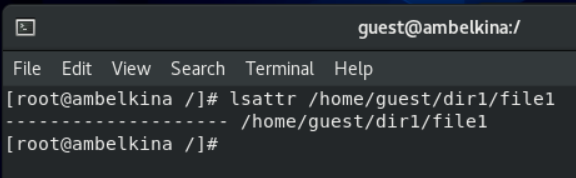

---
# Front matter
lang: ru-RU
title: "Лабораторнаяработа No 4"
subtitle: "Дискреционное разграничение прав в Linux. Расширенные атрибуты"
author: "Белкина Анастасия Михайловна"

# Formatting
toc-title: "Содержание"
toc: true # Table of contents
toc_depth: 2
lof: true # List of figures
lot: true # List of tables
fontsize: 12pt
linestretch: 1.5
papersize: a4paper
documentclass: scrreprt
polyglossia-lang: russian
polyglossia-otherlangs: english
mainfont: PT Serif
romanfont: PT Serif
sansfont: PT Sans
monofont: PT Mono
mainfontoptions: Ligatures=TeX
romanfontoptions: Ligatures=TeX
sansfontoptions: Ligatures=TeX,Scale=MatchLowercase
monofontoptions: Scale=MatchLowercase
indent: true
pdf-engine: lualatex
header-includes:
  - \linepenalty=10 # the penalty added to the badness of each line within a paragraph (no associated penalty node) Increasing the value makes tex try to have fewer lines in the paragraph.
  - \interlinepenalty=0 # value of the penalty (node) added after each line of a paragraph.
  - \hyphenpenalty=50 # the penalty for line breaking at an automatically inserted hyphen
  - \exhyphenpenalty=50 # the penalty for line breaking at an explicit hyphen
  - \binoppenalty=700 # the penalty for breaking a line at a binary operator
  - \relpenalty=500 # the penalty for breaking a line at a relation
  - \clubpenalty=150 # extra penalty for breaking after first line of a paragraph
  - \widowpenalty=150 # extra penalty for breaking before last line of a paragraph
  - \displaywidowpenalty=50 # extra penalty for breaking before last line before a display math
  - \brokenpenalty=100 # extra penalty for page breaking after a hyphenated line
  - \predisplaypenalty=10000 # penalty for breaking before a display
  - \postdisplaypenalty=0 # penalty for breaking after a display
  - \floatingpenalty = 20000 # penalty for splitting an insertion (can only be split footnote in standard LaTeX)
  - \raggedbottom # or \flushbottom
  - \usepackage{float} # keep figures where there are in the text
  - \floatplacement{figure}{H} # keep figures where there are in the text
---

  
  
  
  
  
  

 Лабораторная работа No 4

  

Дискреционное разграничение прав в Linux. Расширенные атрибуты 

  
  
  

 Выполнила: Белкина Анастасия Михайловна, НБИбд-01-18 

  

 Преподаватель: Кулябов Дмитрий Сергеевич 

  
  
  
  
  
  
  
  

# Задание
1. Повысить свои навыки использования интерфейса командой строки (CLI)
2. Познакомиться на примерах с тем, как используются основные и расширенные атрибуты при разграничении доступа
3. Связать теорию дискреционного разделения доступа (дискреционная политика безопасности) с её реализацией на практике в ОС Linux
4. Составить наглядные таблицы, поясняющие какие операции возможны при тех или иных установленных правах
5. Опробовать действие на практике расширенных атрибутов «а» и «i»

# Цель работы

Получение практических навыков работы в консоли с расширенными атрибутами файлов.

# Теоретическое введение

В операционной системе Linux есть много отличных функций безопасности, но она из самых важных - это система прав доступа к файлам. Linux, как последователь идеологии ядра Linux в отличие от Windows, изначально проектировался как многопользовательская система, поэтому права доступа к файлам в linux продуманы очень хорошо.

И это очень важно, потому что локальный доступ к файлам для всех программ и всех пользователей позволил бы вирусам без проблем уничтожить систему. Но новым пользователям могут показаться очень сложными новые права на файлы в linux, которые очень сильно отличаются от того, что мы привыкли видеть в Windows. В этой статье мы попытаемся разобраться в том как работают права файлов в linux, а также как их изменять и устанавливать.

Изначально каждый файл имел три параметра доступа. Вот они:

Чтение - разрешает получать содержимое файла, но на запись нет. Для каталога позволяет получить список файлов и каталогов, расположенных в нем;

Запись - разрешает записывать новые данные в файл или изменять существующие, а также позволяет создавать и изменять файлы и каталоги;

Выполнение - вы не можете выполнить программу, если у нее нет флага выполнения. Этот атрибут устанавливается для всех программ и скриптов, именно с помощью него система может понять, что этот файл нужно запускать как программу.

Но все эти права были бы бессмысленными, если бы применялись сразу для всех пользователей. Поэтому каждый файл имеет три категории пользователей, для которых можно устанавливать различные сочетания прав доступа:

Владелец - набор прав для владельца файла, пользователя, который его создал или сейчас установлен его владельцем. Обычно владелец имеет все права, чтение, запись и выполнение.
Группа - любая группа пользователей, существующая в системе и привязанная к файлу. Но это может быть только одна группа и обычно это группа владельца, хотя для файла можно назначить и другую группу.
Остальные - все пользователи, кроме владельца и пользователей, входящих в группу файла.
Именно с помощью этих наборов полномочий устанавливаются права файлов в linux. Каждый пользователь может получить полный доступ только к файлам, владельцем которых он является или к тем, доступ к которым ему разрешен. Только пользователь Root может работать со всеми файлами независимо от их набора их полномочий.

Но со временем такой системы стало не хватать и было добавлено еще несколько флагов, которые позволяют делать файлы не изменяемыми или же выполнять от имени суперпользователя

# Выполнение лабораторной работы
1. От имени пользователя guest определила расширенные атрибуты файла /home/guest/dir1/file1 командой lsattr /home/guest/dir1/file1

Рис.1 Расширенные атрибуты файла

2. Установила командой chmod 600 file1 на файл file1 права, разрешающие чтение и запись для владельца файла.

Рис.2 Установленные права

3. Попробовала установить на файл /home/guest/dir1/file1 расширенный атрибут a от имени пользователя guest: chattr +a /home/guest/dir1/file1 В ответ получила отказ от выполнения операции.

Рис.3 Отказ

4. Зашла на третью консоль с правами администратора ??? повысила свои права с помощью команды su. Попробовала установить расширенный атрибут a на файл /home/guest/dir1/file1 от имени суперпользователя: chattr +a /home/guest/dir1/file1

Рис.4 Расширенный атрибут

5. От пользователя guest проверила правильность установления атрибута: lsattr /home/guest/dir1/file1

Рис.5 Правильность установления атрибута

6. Выполнила дозапись в файл file1 слова «test» командой echo "test" /home/guest/dir1/file1. После этого выполнила чтение файла file1 командой cat /home/guest/dir1/file1. Убедилась, что слово test было успешно записано в file1.

Рис.6 Дозапись

7. Попробовала удалить файл file1 либо стереть имеющуюся в нём информацию командой echo "abcd" > /home/guest/dirl/file1.Попробовала переименовать файл.

Рис.7 Файл

8. Попробовала с помощью команды chmod 000 file1 установить на файл file1 права, например, запрещающие чтение и запись для владельца файла. Не удалось успешно выполнить.

Рис.8 Выполнение команды

9. Сняла расширенный атрибут a с файла /home/guest/dirl/file1 от имени суперпользователя командой chattr -a /home/guest/dir1/file1. Повторила операции, которые ранее не удавалось выполнить. 

Рис.9 Снятие расширенных атрибутов

10. Повторила  действия по шагам, заменив атрибут «a» атрибутом «i».

Рис.10 Повторение

# Выводы

Действия выполнить не удалось.
Я получила практические навыки работы в консоли с расширенными атрибутами файлов.
