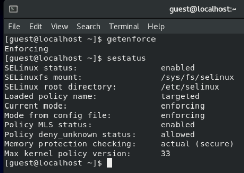

---
# Front matter
lang: ru-RU
title: "Лабораторнаяработа No 6"
subtitle: "Мандатное разграничение прав в Linux"
author: "Белкина Анастасия Михайловна"

# Formatting
toc-title: "Содержание"
toc: true # Table of contents
toc_depth: 2
lof: true # List of figures
lot: true # List of tables
fontsize: 12pt
linestretch: 1.5
papersize: a4paper
documentclass: scrreprt
polyglossia-lang: russian
polyglossia-otherlangs: english
mainfont: PT Serif
romanfont: PT Serif
sansfont: PT Sans
monofont: PT Mono
mainfontoptions: Ligatures=TeX
romanfontoptions: Ligatures=TeX
sansfontoptions: Ligatures=TeX,Scale=MatchLowercase
monofontoptions: Scale=MatchLowercase
indent: true
pdf-engine: lualatex
header-includes:
  - \linepenalty=10 # the penalty added to the badness of each line within a paragraph (no associated penalty node) Increasing the value makes tex try to have fewer lines in the paragraph.
  - \interlinepenalty=0 # value of the penalty (node) added after each line of a paragraph.
  - \hyphenpenalty=50 # the penalty for line breaking at an automatically inserted hyphen
  - \exhyphenpenalty=50 # the penalty for line breaking at an explicit hyphen
  - \binoppenalty=700 # the penalty for breaking a line at a binary operator
  - \relpenalty=500 # the penalty for breaking a line at a relation
  - \clubpenalty=150 # extra penalty for breaking after first line of a paragraph
  - \widowpenalty=150 # extra penalty for breaking before last line of a paragraph
  - \displaywidowpenalty=50 # extra penalty for breaking before last line before a display math
  - \brokenpenalty=100 # extra penalty for page breaking after a hyphenated line
  - \predisplaypenalty=10000 # penalty for breaking before a display
  - \postdisplaypenalty=0 # penalty for breaking after a display
  - \floatingpenalty = 20000 # penalty for splitting an insertion (can only be split footnote in standard LaTeX)
  - \raggedbottom # or \flushbottom
  - \usepackage{float} # keep figures where there are in the text
  - \floatplacement{figure}{H} # keep figures where there are in the text
---

  
  
  
  
  
  

 Лабораторная работа No 6

  

Мандатное разграничение прав в Linux 

  
  
  

 Выполнила: Белкина Анастасия Михайловна, НБИбд-01-18 

  

 Преподаватель: Кулябов Дмитрий Сергеевич 

  
  
  
  
  
  
  
  

# Цель работы

Развить навыки администрирования ОС Linux. Получить первое практическое знакомство с технологией SELinux1. 
Проверить работу SELinx на практике совместно с веб-сервером Apache.

# Теоретическое введение

В операционной системе Linux есть много отличных функций безопасности, но она из самых важных - это система прав доступа к файлам. Linux, как последователь идеологии ядра Linux в отличие от Windows, изначально проектировался как многопользовательская система, поэтому права доступа к файлам в linux продуманы очень хорошо.

И это очень важно, потому что локальный доступ к файлам для всех программ и всех пользователей позволил бы вирусам без проблем уничтожить систему. Но новым пользователям могут показаться очень сложными новые права на файлы в linux, которые очень сильно отличаются от того, что мы привыкли видеть в Windows. В этой статье мы попытаемся разобраться в том как работают права файлов в linux, а также как их изменять и устанавливать.

Изначально каждый файл имел три параметра доступа. Вот они:

Чтение - разрешает получать содержимое файла, но на запись нет. Для каталога позволяет получить список файлов и каталогов, расположенных в нем;

Запись - разрешает записывать новые данные в файл или изменять существующие, а также позволяет создавать и изменять файлы и каталоги;

Выполнение - вы не можете выполнить программу, если у нее нет флага выполнения. Этот атрибут устанавливается для всех программ и скриптов, именно с помощью него система может понять, что этот файл нужно запускать как программу.

Но все эти права были бы бессмысленными, если бы применялись сразу для всех пользователей. Поэтому каждый файл имеет три категории пользователей, для которых можно устанавливать различные сочетания прав доступа:

Владелец - набор прав для владельца файла, пользователя, который его создал или сейчас установлен его владельцем. Обычно владелец имеет все права, чтение, запись и выполнение.
Группа - любая группа пользователей, существующая в системе и привязанная к файлу. Но это может быть только одна группа и обычно это группа владельца, хотя для файла можно назначить и другую группу.
Остальные - все пользователи, кроме владельца и пользователей, входящих в группу файла.
Именно с помощью этих наборов полномочий устанавливаются права файлов в linux. Каждый пользователь может получить полный доступ только к файлам, владельцем которых он является или к тем, доступ к которым ему разрешен. Только пользователь Root может работать со всеми файлами независимо от их набора их полномочий.

Но со временем такой системы стало не хватать и было добавлено еще несколько флагов, которые позволяют делать файлы не изменяемыми или же выполнять от имени суперпользователя

# Выполнение лабораторной работы
1. Вошла в систему с полученными учётными данными и убедилась, что SELinux работает в режиме enforcing политики targeted с помощью команд getenforce и sestatus.

Рис.1 SELinux работает

2. Обратилась с помощью браузера к веб-серверу, запущенному на компьютере, и убедилась, что последний работает:
service httpd status
или
/etc/rc.d/init.d/httpd status

Рис.2 Обращение к веб-серверу

3. Нашла веб-сервер Apache в списке процессов, определила его контекст безопасности и занесла эту информацию в отчёт. Например, можно использовать команду
ps auxZ | grep httpd
или
ps -eZ | grep httpd

Рис.3 Веб-сервер Apache

4. Посмотрела текущее состояние переключателей SELinux для Apache с помощью команды sestatus -bigrep httpd

Рис.4 Текущее состояние переключателей SELinux

5. Посмотрела статистику по политике с помощью команды seinfo, также определила множество пользователей, ролей, типов.

Рис.5 Статистика

6. Определила тип файлов и поддиректорий, находящихся в директории /var/www, с помощью команды ls -lZ /var/www

Рис.6 Тип файлов и поддиректорий

7. Определила тип файлов, находящихся в директории /var/www/html: ls -lZ /var/www/html

Рис.7 Тип файлов

8. Определила круг пользователей, которым разрешено создание файлов в директории /var/www/html.

Рис.8 Круг пользователей

9. Создала от имени суперпользователя (так как в дистрибутиве после установки только ему разрешена запись в директорию) html-файл
/var/www/html/test.html следующего содержания: <html> <body>test</body></html> 

Рис.9 html-файл

10. Проверила контекст созданного файла. Занесла в отчёт контекст, присваиваемый по умолчанию вновь созданным файлам в директории /var/www/html

Рис.10 Контекст созданного файла

11. Обратилась к файлу через веб-сервер, введя в браузере адрес http://127.0.0.1/test.html. Убедилась, что файл был успешно отображён

Рис.11 Файл в браузере

12. Изучила справку man httpd_selinux и выяснила, какие контексты файлов определены для httpd. Сопоставила их с типом файла
test.html. Проверила контекст файла командой ls -Z.
ls -Z /var/www/html/test.html

Рис.12 Контексты

13. Измените контекст файла /var/www/html/test.html с httpd_sys_content_t на любой другой, к которому процесс httpd не должен иметь доступа, например, на samba_share_t:
chcon -t samba_share_t /var/www/html/test.html
ls -Z /var/www/html/test.html
Проверила, что контекст поменялся.

Рис.13 Измененный контекст

14. Попробовала ещё раз получить доступ к файлу через веб-сервер, введя в браузере адрес http://127.0.0.1/test.html. Получила сообщение об ошибке:
Forbidden
You don't have permission to access /test.html on this server.

Рис.14 Ошибка

15. Проанализировала ситуацию. Почему файл не был отображён, если права доступа позволяют читать этот файл любому пользователю?
ls -l /var/www/html/test.html
Просмотрела log-файлы веб-сервера Apache. Также просмотрела системный лог-файл:
tail /var/log/messages
Если в системе окажутся запущенными процессы setroubleshootd и audtd, то также смогла увидеть ошибки, аналогичные указанным
выше, в файле /var/log/audit/audit.log. Проверила это утверждение самостоятельно.

Рис.15 Ошибки

16. Попробовала запустить веб-сервер Apache на прослушивание ТСР-порта 81 (а не 80, как рекомендует IANA и прописано в /etc/services. Для этого в файле /etc/httpd/httpd.conf нашла строчку Listen 80 и заменила её на Listen 81.

Рис.16 ТСР-порт 81

17. Выполнила перезапуск веб-сервера Apache. Произошёл сбой.

Рис.17 Сбой

18. Проанализировала лог-файлы:
tail -nl /var/log/messages
Просмотрела файлы /var/log/http/error_log, /var/log/http/access_log и /var/log/audit/audit.log и выяснила, в каких файлах появились записи.

Рис.18 Лог-файлы

19. Выполнила команду semanage port -a -t http_port_t -р tcp 81
После этого проверила список портов командой semanage port -l | grep http_port_t
Убедилась, что порт 81 появился в списке.

Рис.19 Порт 81

20. Попробовала запустить веб-сервер Apache ещё раз.

Рис.20 Веб-сервер Apache

21. Вернула контекст httpd_sys_cоntent__t к файлу /var/www/html/ test.html:
chcon -t httpd_sys_content_t /var/www/html/test.html
После этого попробовала получить доступ к файлу через веб-сервер, введя в браузере адрес http://127.0.0.1:81/test.html.
Увидела содержимое файла — слово «test»

Рис.21 Слово text

22. Исправила обратно конфигурационный файл apache, вернув Listen 80

Рис.22 Возвращение

23. Удалила привязку http_port_t к 81 порту:
semanage port -d -t http_port_t -p tcp 81
и проверила, что порт 81 удалён.

Рис.23 Удален порт

24. Удалила файл /var/www/html/test.html:
rm /var/www/html/test.html

Рис.24 Удален файл

# Выводы

Развила навыки администрирования ОС Linux. Получила первое практическое знакомство с технологией SELinux1. 
Проверила работу SELinx на практике совместно с веб-сервером Apache.
