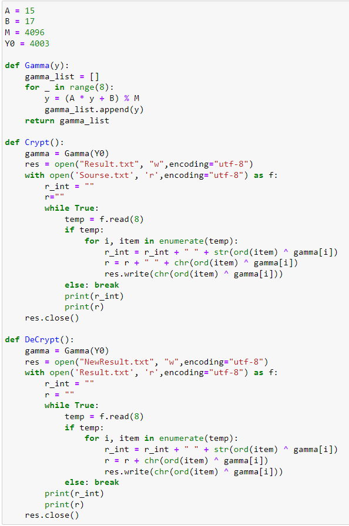

---
# Front matter
lang: ru-RU
title: "Лабораторнаяработа No 7"
subtitle: "Элементы криптографии. Однократное гаммирование"
author: "Белкина Анастасия Михайловна"

# Formatting
toc-title: "Содержание"
toc: true # Table of contents
toc_depth: 2
lof: true # List of figures
lot: true # List of tables
fontsize: 12pt
linestretch: 1.5
papersize: a4paper
documentclass: scrreprt
polyglossia-lang: russian
polyglossia-otherlangs: english
mainfont: PT Serif
romanfont: PT Serif
sansfont: PT Sans
monofont: PT Mono
mainfontoptions: Ligatures=TeX
romanfontoptions: Ligatures=TeX
sansfontoptions: Ligatures=TeX,Scale=MatchLowercase
monofontoptions: Scale=MatchLowercase
indent: true
pdf-engine: lualatex
header-includes:
  - \linepenalty=10 # the penalty added to the badness of each line within a paragraph (no associated penalty node) Increasing the value makes tex try to have fewer lines in the paragraph.
  - \interlinepenalty=0 # value of the penalty (node) added after each line of a paragraph.
  - \hyphenpenalty=50 # the penalty for line breaking at an automatically inserted hyphen
  - \exhyphenpenalty=50 # the penalty for line breaking at an explicit hyphen
  - \binoppenalty=700 # the penalty for breaking a line at a binary operator
  - \relpenalty=500 # the penalty for breaking a line at a relation
  - \clubpenalty=150 # extra penalty for breaking after first line of a paragraph
  - \widowpenalty=150 # extra penalty for breaking before last line of a paragraph
  - \displaywidowpenalty=50 # extra penalty for breaking before last line before a display math
  - \brokenpenalty=100 # extra penalty for page breaking after a hyphenated line
  - \predisplaypenalty=10000 # penalty for breaking before a display
  - \postdisplaypenalty=0 # penalty for breaking after a display
  - \floatingpenalty = 20000 # penalty for splitting an insertion (can only be split footnote in standard LaTeX)
  - \raggedbottom # or \flushbottom
  - \usepackage{float} # keep figures where there are in the text
  - \floatplacement{figure}{H} # keep figures where there are in the text
---

  
  
  
  
  
  

 Лабораторная работа No 7

  

Элементы криптографии. Однократное гаммирование 

  
  
  

 Выполнила: Белкина Анастасия Михайловна, НБИбд-01-18 

  

 Преподаватель: Кулябов Дмитрий Сергеевич 

  
  
  
  
  
  
  
  

# Цель работы

Освоить на практике применение режима однократного гаммирования.

# Задание

1. Изучить указания к работе
2. Подобрать ключ
3. Определить вид шифротекста при известном ключе и известном открытом тексте
4. Определить ключ, с помощью которого шифротекст может быть преобразован в некоторый фрагмент текста

# Теоретическое введение

В операционной системе Linux есть много отличных функций безопасности, но она из самых важных - это система прав доступа к файлам. Linux, как последователь идеологии ядра Linux в отличие от Windows, изначально проектировался как многопользовательская система, поэтому права доступа к файлам в linux продуманы очень хорошо.

И это очень важно, потому что локальный доступ к файлам для всех программ и всех пользователей позволил бы вирусам без проблем уничтожить систему. Но новым пользователям могут показаться очень сложными новые права на файлы в linux, которые очень сильно отличаются от того, что мы привыкли видеть в Windows. В этой статье мы попытаемся разобраться в том как работают права файлов в linux, а также как их изменять и устанавливать.

Изначально каждый файл имел три параметра доступа. Вот они:

Чтение - разрешает получать содержимое файла, но на запись нет. Для каталога позволяет получить список файлов и каталогов, расположенных в нем;

Запись - разрешает записывать новые данные в файл или изменять существующие, а также позволяет создавать и изменять файлы и каталоги;

Выполнение - вы не можете выполнить программу, если у нее нет флага выполнения. Этот атрибут устанавливается для всех программ и скриптов, именно с помощью него система может понять, что этот файл нужно запускать как программу.

Но все эти права были бы бессмысленными, если бы применялись сразу для всех пользователей. Поэтому каждый файл имеет три категории пользователей, для которых можно устанавливать различные сочетания прав доступа:

Владелец - набор прав для владельца файла, пользователя, который его создал или сейчас установлен его владельцем. Обычно владелец имеет все права, чтение, запись и выполнение.
Группа - любая группа пользователей, существующая в системе и привязанная к файлу. Но это может быть только одна группа и обычно это группа владельца, хотя для файла можно назначить и другую группу.
Остальные - все пользователи, кроме владельца и пользователей, входящих в группу файла.
Именно с помощью этих наборов полномочий устанавливаются права файлов в linux. Каждый пользователь может получить полный доступ только к файлам, владельцем которых он является или к тем, доступ к которым ему разрешен. Только пользователь Root может работать со всеми файлами независимо от их набора их полномочий.

Но со временем такой системы стало не хватать и было добавлено еще несколько флагов, которые позволяют делать файлы не изменяемыми или же выполнять от имени суперпользователя

# Выполнение лабораторной работы
1. Код программы на Python

Рис.1 Код

2. Файл Sourse

Рис.2 Sourse.txt

3. Файл Result

Рис.3 Result.txt

4. Файл NewResult

Рис.4 NewResult.txt

5. Код функций:
A = 15
B = 17
M = 4096
Y0 = 4003

def Gamma(y):
    gamma_list = []
    for _ in range(8):
        y = (A * y + B) % M
        gamma_list.append(y)
    return gamma_list

def Crypt():
    gamma = Gamma(Y0)
    res = open("Result.txt", "w",encoding="utf-8")
    with open('Sourse.txt', 'r',encoding="utf-8") as f:
        r_int = ""
        r=""
        while True:
            temp = f.read(8)
            if temp:
                for i, item in enumerate(temp):
                    r_int = r_int + " " + str(ord(item) ^ gamma[i])
                    r = r + " " + chr(ord(item) ^ gamma[i])
                    res.write(chr(ord(item) ^ gamma[i]))
            else: break
            print(r_int)
            print(r)
    res.close()

def DeCrypt():
    gamma = Gamma(Y0)
    res = open("NewResult.txt", "w",encoding="utf-8")
    with open('Result.txt', 'r',encoding="utf-8") as f:
        r_int = ""
        r = ""
        while True:
            temp = f.read(8)
            if temp:
                for i, item in enumerate(temp):
                    r_int = r_int + " " + str(ord(item) ^ gamma[i])
                    r = r + chr(ord(item) ^ gamma[i])
                    res.write(chr(ord(item) ^ gamma[i]))
            else: break
        print(r_int)
        print(r)
    res.close()

# Выводы

Выполняя данную лабораторную работу, я освоила на практике применение режима однократного гаммирования